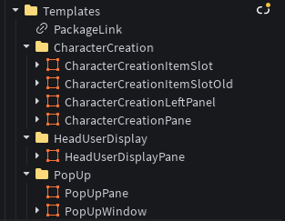

# @rbxts/quirk-ui

A modern, component-based UI library for Roblox-TS with reusable components and utilities.

## Features

- 🎨 **Component-based architecture** - Build UIs with reusable components
- 🎮 **Roblox-TS optimized** - Built specifically for Roblox TypeScript development
- 🛠️ **Template-based hydration** - Uses Roblox GUI templates that get hydrated with TypeScript logic
- 🔧 **Utility classes** - GuiController, GuiBase, GuiButton, and more
- 📦 **Easy to use** - Simple API for managing UI state and interactions
- 🔧 **TypeScript support** - Full type definitions included

## Installation

```bash
npm install @rbxts/quirk-ui
```

## Quick Start

This library uses a template-based approach where you create GUI templates in Roblox Studio and hydrate them with TypeScript logic.

### 1. Create GUI Templates in Roblox Studio
Create a `Templates` folder in ReplicatedStorage and organize your UI templates by functionality:



Each template should be a Folder containing your UI elements with descriptive names (e.g., "Button1", "Button2").


### 2. Hydrate with TypeScript
```typescript
import { UiManager, GuiController, GuiBase } from "@rbxts/quirk-ui";

// Create a custom pane that hydrates your template
class MyCustomPane extends GuiBase<"Button1" | "Button2"> {
    private button1 = this.resolve<ImageButton>("Button1");
    private button2 = this.resolve<ImageButton>("Button2");

    constructor() {
        super({ 
            Template: "MyCustomPane", // Name of your GUI template
            InstanceKeys: { 
                Button1: "Button1", 
                Button2: "Button2" 
            } 
        });
    }
}

// Create a controller
class MyController extends GuiController {
    constructor() {
        super("MyController", new MyCustomPane(), {
            CanHide: true,
            IgnoreGuiInset: false,
            DisabledCoreGuis: [Enum.CoreGuiType.PlayerList],
        });
    }
}

// Register and use
const controller = UiManager.RegisterController(new MyController());
UiManager.Show("MyController");
```

## How It Works

This library follows a **template hydration pattern**:

1. **Design in Roblox Studio**: Create organized template folders in ReplicatedStorage
2. **Hydrate with TypeScript**: Use `GuiBase` to connect your template to TypeScript logic
3. **Manage with Controllers**: Use `GuiController` to handle show/hide logic and settings
4. **Coordinate with UiManager**: Register controllers and manage UI state globally

### Utility Classes

- **UiManager** - Main UI management system
- **GuiController** - Base controller for UI components
- **GuiBase** - Base class for GUI components
- **GuiButton** - Enhanced button component
- **GuiSound** - Sound management utilities

## API Reference

### UiManager

The main UI management system that handles registration and display of controllers.

```typescript
// Register a controller
UiManager.RegisterController(controller: GuiController): GuiController

// Show a controller
UiManager.Show(namespace: string): void

// Hide a controller
UiManager.Hide(namespace: string): void

// Mount all registered controllers
UiManager.Mount(): void
```

### GuiController

Base class for creating UI controllers.

```typescript
class MyController extends GuiController {
    constructor(
        namespace: string,
        gui: GuiBase<string>,
        settings: GuiControllerSettings
    ) {
        super(namespace, gui, settings);
    }
}
```

### GuiControllerSettings

Configuration options for GUI controllers.

```typescript
interface GuiControllerSettings {
    HideWithState?: boolean;
    CanHide?: boolean;
    Visible?: boolean;
    DisabledCoreGuis?: Enum.CoreGuiType[];
    PopUp?: boolean;
    IgnoreGuiInset?: boolean;
    DisplayOrder?: number;
}
```

